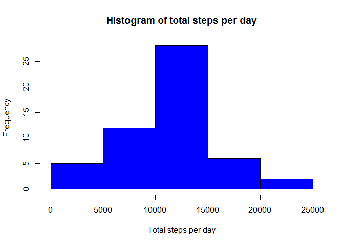
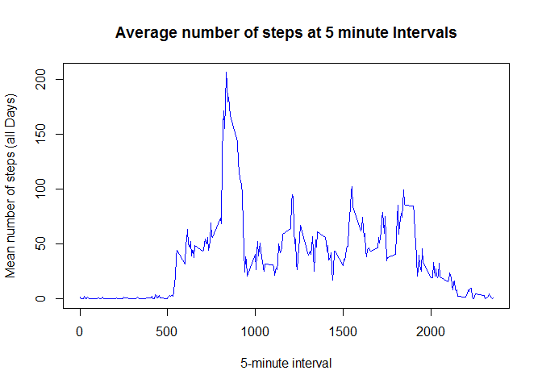
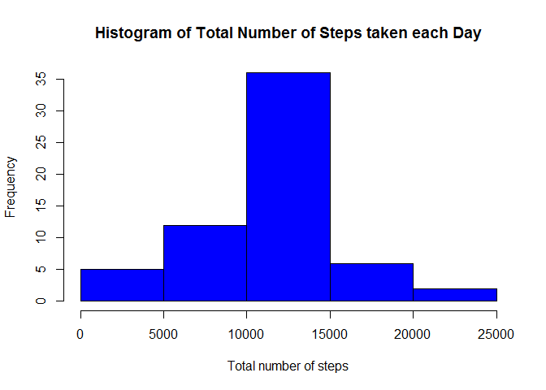
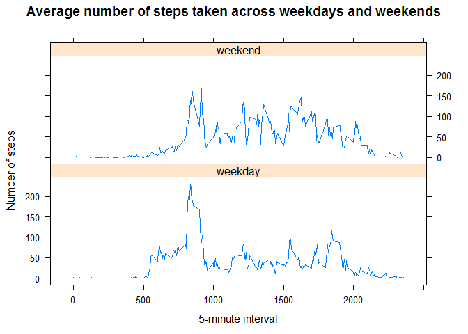

# Reproducible Research: Peer Assessment 1

## Loading and preprocessing the data

```r
setwd("c:/Users/R/module 5")
activity <- read.csv("activity.csv", header = T, sep = ",")
```

## What is mean total number of steps taken per day?

```r
totalSteps <- aggregate(steps ~ date, data = activity, sum, na.rm = TRUE)
hist(totalSteps$steps,col="blue",main="Histogram of total steps per day",
     xlab="Total steps per day")
```

 

Calculate and report the mean and median total number of steps taken per day:

```r
meanstep <- mean(totalSteps$steps)
print(meanstep)
```

```
## [1] 10766.19
```

```r
medianstep <- median(totalSteps$steps)
print(medianstep)
```

```
## [1] 10765
```

## What is the average daily activity pattern?

```r
stepsinterval <- aggregate(steps ~ interval, data = activity, mean, na.rm = TRUE)
plot(steps ~ interval, data = stepsinterval, type = "l", 
     xlab = "5-minute interval", 
     ylab = "Mean number of steps (all Days)", 
     main = "Average number of steps at 5 minute Intervals",  
     col = "blue")
```

 

Which 5-minute interval, on average across all the days in the dataset, contains the maximum number of steps?

```r
maxstep <- stepsinterval[which.max(stepsinterval$steps),"interval"]
print(maxstep)
```

```
## [1] 835
```

## Imputing missing values

Calculate and report the total number of missing values in the dataset:

```r
missing <- sum(is.na(activity))
print(missing)
```

```
## [1] 2304
```

Devise a strategy for filling in all of the missing values in the dataset. The strategy does not need to be sophisticated. For example, you could use the mean/median for that day, or the mean for that 5-minute interval, etc.
Create a new dataset that is equal to the original dataset but with the missing data filled in.

```r
getmean <- function(interval){
    stepsinterval[stepsinterval$interval==interval,"steps"]
    }
activity2 <- activity
flag = 0
for (i in 1:nrow(activity2)) {
    if (is.na(activity2[i,"steps"])) {
        activity2[i,"steps"] <- getmean(activity2[i,"interval"])
        flag = flag + 1
        }
    }
```

Make a histogram of the total number of steps taken each day and Calculate and report the mean and median total number of steps taken per day. 

```r
totalstepsperday <- aggregate(steps ~ date, data = activity2, sum)
hist(totalstepsperday$steps, 
     main = "Histogram of Total Number of Steps taken each Day",
     xlab = "Total number of steps", 
     ylab = "Frequency", 
     col = "blue")
```

 

```r
meanstep2 <- mean(totalstepsperday$steps)
print(meanstep2)
```

```
## [1] 10766.19
```

```r
medianstep2 <- median(totalstepsperday$steps)
print(medianstep2)
```

```
## [1] 10766.19
```

Do these values differ from the estimates from the first part of the assignment? 

- The mean value remains the same as the first part, but the median value has changed.

What is the impact of imputing missing data on the estimates of the total daily number of steps?

- The mean value remains unchanged since the mean value has been used for that particular 5-minute interval.

- The median value is different since the median index is being changed after imputing missing values.

## Are there differences in activity patterns between weekdays and weekends?

Create a new factor variable in the dataset with two levels - "weekday" and "weekend" indicating whether a given date is a weekday or weekend day.

Make a panel plot containing a time series plot of the 5-minute interval (x-axis) and the average number of steps taken, averaged across all weekday days or weekend days (y-axis).

```r
activity2$day <- ifelse(as.POSIXlt(as.Date(activity2$date))$wday%%6 == 0, "weekend", "weekday")
activity2$day <- factor(activity2$day, levels = c("weekday", "weekend"))

library(lattice)
steps_interval <- aggregate(steps ~ interval + day, activity2, mean)
xyplot(steps ~ interval | factor(day), data = steps_interval, layout = c(1, 2), type = "l",
       xlab = "5-minute interval",
       ylab = "Number of steps",
       main = "Average number of steps taken across weekdays and weekends")
```

 
